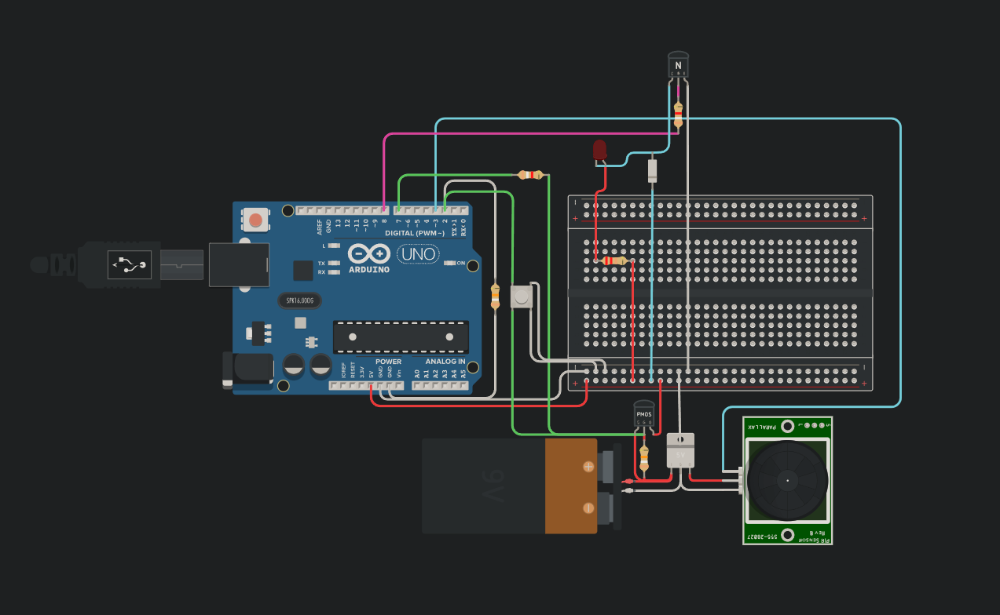
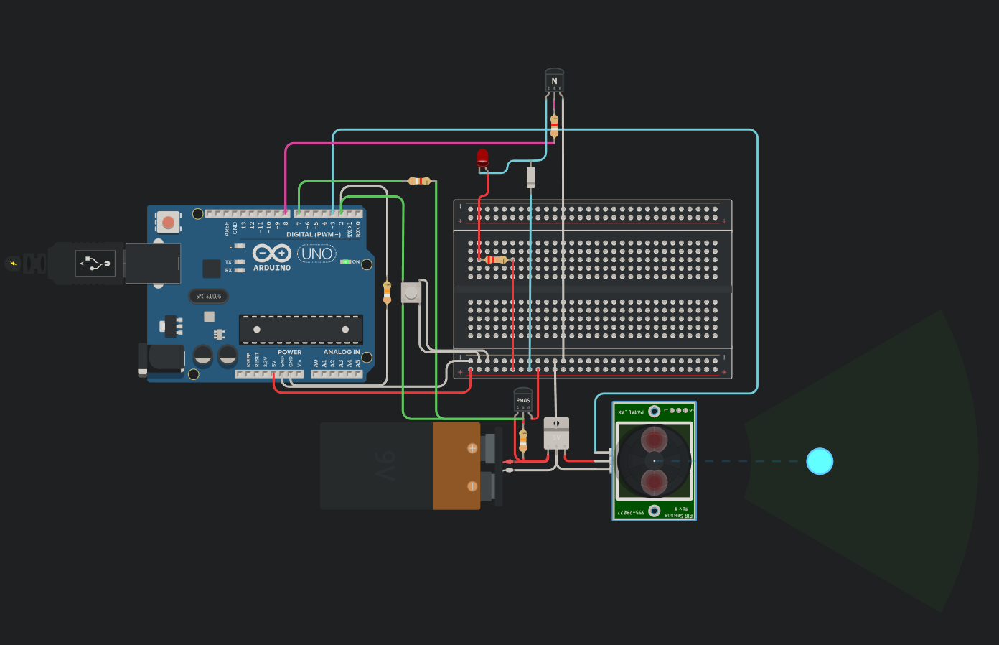
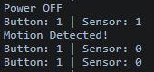
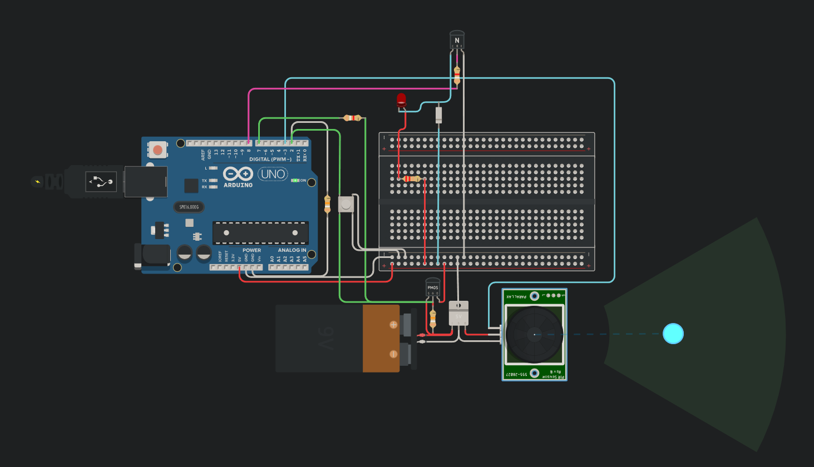
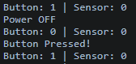

# Arduino Latching Power System

## Overview

This project implements a **latching power system** using Arduino, a **PMOS transistor**, a **push button**, and a **PIR motion sensor**.

The system can:

* Turn ON using a button
* Stay powered using a latch circuit
* Detect motion using a PIR sensor
* Blink an LED as feedback
* Automatically turn OFF after inactivity

---

## Features

* Button trigger (manual control)
* PIR motion detection
* Latching power (self-hold)
* Auto shutdown after 5 seconds
* LED feedback (3 blinks)
* Serial Monitor debugging

---

## Components

* Arduino UNO
* PMOS Transistor
* NPN Transistor
* PIR Motion Sensor
* Push Button
* LED
* Resistors (10k, 1k, 220Ω)
* Breadboard & wires

---

## How It Works

1. Pressing the button powers the system ON.
2. Arduino activates the latch (keeps power ON).
3. Button or motion triggers LED blinking.
4. If no activity for 5 seconds → system powers OFF.

---

## Circuit & Results

### Full Circuit



### Sensor Detection



### Serial Monitor (Sensor)



### Button Pressed



### Serial Monitor (Button)



---

## Code

```cpp
#define LATCH 7
#define BUTTON 2
#define SENSOR 3
#define LED 8

bool lastButtonState = HIGH;
bool lastSensorState = LOW;

unsigned long lastActionTime = 0;

void setup() {
  pinMode(LATCH, OUTPUT);
  digitalWrite(LATCH, LOW);

  pinMode(BUTTON, INPUT_PULLUP);
  pinMode(SENSOR, INPUT);
  pinMode(LED, OUTPUT);

  Serial.begin(9600);
  Serial.println("System ON");
}

void loop() {

  int buttonState = digitalRead(BUTTON);
  int sensorState = digitalRead(SENSOR);

  Serial.print("Button: ");
  Serial.print(buttonState);
  Serial.print(" | Sensor: ");
  Serial.println(sensorState);

  if (buttonState == LOW && lastButtonState == HIGH) {
    Serial.println("Button Pressed!");
    triggerAction();
  }

  if (sensorState == HIGH && lastSensorState == LOW) {
    Serial.println("Motion Detected!");
    triggerAction();
  }

  lastButtonState = buttonState;
  lastSensorState = sensorState;

  if (millis() - lastActionTime > 5000) {
    Serial.println("Power OFF");
    delay(100);
    digitalWrite(LATCH, HIGH);
  }
}

void triggerAction() {
  lastActionTime = millis();

  for (int i = 0; i < 3; i++) {
    digitalWrite(LED, HIGH);
    delay(300);
    digitalWrite(LED, LOW);
    delay(300);
  }
}
```

---

## Future Improvements

* Wake-up using PIR while system is OFF
* Replace PMOS with more efficient MOSFET
* Add buzzer or display feedback

